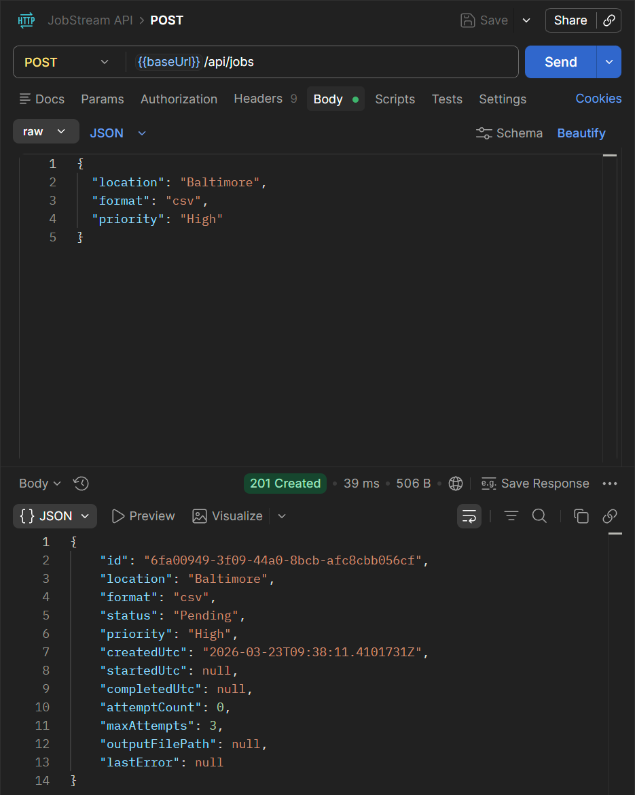
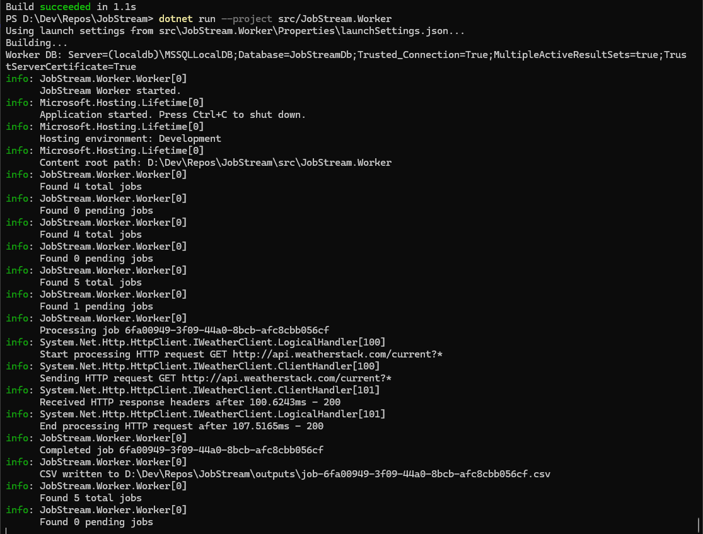
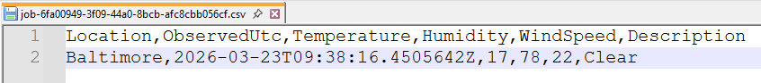

# JobStream

Asynchronous job processing platform built with ASP.NET Core and .NET, designed to process external API data and generate CSV exports using a background worker architecture.

---

## Overview

JobStream demonstrates how to design and implement a **reliable, asynchronous backend system** that processes long-running tasks outside of the request lifecycle.

The system allows clients to submit jobs via a REST API, persists them to a database, and processes them in the background using a worker service.

This project emphasizes backend system design patterns commonly used in scalable, resilient, and distributed systems.

### Key capabilities:
- Decouples request handling from long-running processing
- Tracks job lifecycle state (Pending → Processing → Completed / Failed)
- Implements retry logic for fault tolerance
- Integrates with external APIs
- Produces downloadable output artifacts (CSV files)

---

## Problem It Solves

In real-world systems, certain operations (API calls, data exports, report generation) can take seconds or minutes to complete.

Handling these operations synchronously:
- blocks API threads
- degrades performance
- leads to timeouts

JobStream solves this by:
- offloading work to a background worker
- persisting job state in a database
- allowing clients to poll for job status
- enabling safe retries on failure

This pattern is commonly used in:
- data export systems
- reporting pipelines
- integration services
- ETL workflows

---

## Architecture

```
Client → API → SQL Server → Worker → External API → File Output
```

### Flow

1. Client submits job via API
2. Job is persisted with `Pending` status
3. Worker polls and picks up pending jobs
4. Worker transitions job to `Processing`
5. External API is called
6. CSV is generated
7. Job transitions to `Completed` or `Failed`
8. Client retrieves status or downloads file

### Components

- **JobStream.Api**
  - REST endpoints for job creation and retrieval

- **JobStream.Worker**
  - Background service that processes jobs asynchronously

- **JobStream.Application**
  - Interfaces and business logic contracts

- **JobStream.Infrastructure**
  - EF Core persistence, external API integration, CSV export

- **SQL Server**
  - Stores job state and metadata

---

## Features

- Asynchronous job processing using background workers
- External API integration (Weatherstack)
- CSV file generation and export
- Retry logic with configurable max attempts and failure recovery
- Error tracking and logging
- Clean layered architecture (API / Application / Infrastructure)

---

## API Endpoints

### Create Job

```http
POST /api/jobs
```

```json
{
  "location": "Baltimore",
  "format": "csv",
  "priority": "High"
}
```

### Get All Jobs

```http
GET /api/jobs
```

### Get Jobs Filtered By Status

```http
GET /api/jobs?status={status}
```

### Get Job By ID

```http
GET /api/jobs/{id}
```

### Download Job Output

```http
GET /api/jobs/{id}/download
```

---

## Example Workflow

1. Client submits a job via `POST /api/jobs`
2. Job is stored with status `Pending`
3. Worker picks up the job and sets status to `Processing`
4. External API is called and data is processed
5. CSV file is generated and saved
6. Job is marked as `Completed`
7. Client retrieves job status via `GET /api/jobs/{id}`
8. Client downloads output via `/download` endpoint

---

## Example Output

```csv
Location,Temperature,WeatherDescription
Baltimore,72,Partly cloudy
```

---

## Configuration

Sensitive values such as API keys are not stored in source control.

Use .NET User Secrets for local development:

```bash
dotnet user-secrets set "Weatherstack:ApiKey" "YOUR_API_KEY" --project src/JobStream.Worker/JobStream.Worker.csproj
```

---

## Tech Stack
- C#
- ASP.NET Core
- Entity Framework Core
- SQL Server
- Background Services (IHostedService)
- HttpClientFactory
- REST APIs

---

## Key Concepts Demonstrated

- Asynchronous background processing
- Job lifecycle management (state transitions)
- Fault tolerance and retry handling
- Separation of concerns (API, Application, Infrastructure)
- Repository pattern and data persistence
- External API integration
- File generation and streaming (CSV download)
- Structured logging and observability

---

## Screenshots

### Create Job (API)



---

### Worker Processing Jobs



---

### Generated CSV Output



---

## Future Improvements

- Replace polling with message queue (Azure Queue, RabbitMQ)
- Implement distributed workers for scalability
- Add authentication and authorization
- Add rate limiting and request validation
- Introduce job prioritization queues
- Add integration and unit tests
- Dockerize application for deployment

---

## Author
Anna Aladiev

---